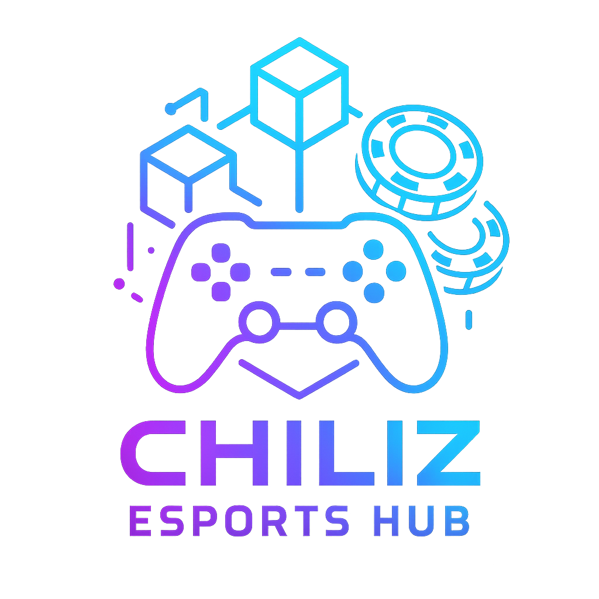

# 🔥 ChiliZ eSports Hub - SportFi Revolution for Fans & Athletes


> **Vibe-first SportFi platform** - Connecting fans and athletes through prediction markets, skill showcases, community governance, and token rewards. Built for the Chiliz hackathon with pure passion and code.

## 🚀 The SportFi Vision

**Fans deserve more than just watching.** They should own, earn, and govern the experiences they love.

ChiliZ eSports Hub flips traditional fan engagement by putting supporters at the center of the action. Predict match outcomes, showcase your skills, vote on platform decisions, learn from pro players, and trade exclusive digital collectibles - all while earning CHZ tokens.

### 🎯 Fan-First Features

- **🔮 Fan Predictions**: Bet on your favorite teams with real CHZ rewards
- **🎬 Creator Economy**: Upload gameplay, earn tokens, build your fanbase  
- **🏛️ Fan Governance**: Vote with your tokens, shape the platform's future
- **🎓 Skill Academy**: Learn from pros through exclusive NFT courses
- **🛒 Fan Marketplace**: Trade rare collectibles and digital memorabilia

## 🏗️ Technical Stack

**Built for speed, shipped with passion** - This SportFi platform leverages modern Web3 tech to create seamless fan experiences.

### Core Technologies
- **Frontend**: React 18 + TypeScript + Vite for lightning-fast development
- **Backend**: Node.js + Express with real-time WebSocket connections
- **Blockchain**: Chiliz Spicy Testnet with Thirdweb SDK integration
- **Storage**: IPFS for decentralized content + PostgreSQL for app data
- **UI/UX**: shadcn/ui components with Valorant-inspired gaming aesthetics

### Smart Contracts
- **PredictionMarket**: Fan betting with dynamic odds
- **FanTokenDAO**: Community governance and voting
- **SkillShowcase**: Creator rewards and verification
- **CourseNFT**: Educational marketplace for athletes
- **Marketplace**: P2P trading for digital collectibles

## 🚀 Quick Start Guide

### Prerequisites
- Node.js 18+ with npm/yarn
- MetaMask wallet with Chiliz Spicy Testnet configured
- Git for version control

### Installation

```bash
# Clone the revolutionary platform
git clone https://github.com/Ankur2606/Decentralized_Esports_Hub
cd Decentralized_Esports_Hub

# Install dependencies
npm install

# Configure environment variables
cp .env.example .env
# Add your API keys: NFT_STORAGE_API_KEY, THIRDWEB_SECRET_KEY, etc.

# Deploy smart contracts (Admin only)
npm run deploy:contracts

# Start development server
npm run dev
```

### Network Configuration

Add Chiliz Spicy Testnet to MetaMask:
```json
{
  "chainId": "0x15B3A",
  "chainName": "Chiliz Spicy Testnet",
  "rpcUrls": ["https://spicy-rpc.chiliz.com/"],
  "chainID": 88882
  "nativeCurrency": {
    "name": "CHZ",
    "symbol": "CHZ",
    "decimals": 18
  },
  "blockExplorerUrls": ["https://spicy-explorer.chiliz.com/"]
}
```

## 🎮 For the Hackathon Community

### The SportFi Problem We're Solving

**Traditional fan engagement is broken.** Fans spend money on merchandise and tickets but have zero ownership in the experiences they love. Athletes create amazing content but rely on centralized platforms that extract most of the value.

### Our Hackathon Solution

**Direct fan-to-athlete economic relationships powered by CHZ tokens.**

- **Prediction Markets**: Fans bet on their favorite athletes with real skin in the game
- **Creator Economy**: Athletes earn CHZ directly from fans who value their content  
- **Community Governance**: Platform decisions made by the people who use it most
- **Skill Marketplace**: Athletes monetize their expertise through exclusive courses
- **Digital Collectibles**: Rare moments and achievements become tradeable assets

### Why This Matters for SportFi

This platform demonstrates how Chiliz can power the entire fan experience economy - not just tokenized voting, but prediction markets, content creation, education, and commerce. It's a complete SportFi ecosystem that puts fans and athletes at the center.

## 🎨 Hackathon Highlights

### Vibe-First Design
- **Dark Gaming Aesthetic**: Valorant-inspired UI with immersive purple/cyan gradients
- **Real-Time Updates**: WebSocket connections for live betting and governance
- **Mobile-First**: Responsive design that works on any device
- **Smooth Animations**: Carousel interactions and smooth transitions

### Technical Innovation
- **Smart Contract Architecture**: 5 interconnected contracts managing the entire ecosystem
- **IPFS Integration**: Decentralized storage for videos and course content
- **Token Economics**: CHZ rewards for creators, governance participation, and trading
- **Real-Time Data**: Live updates for betting pools, video likes, and DAO votes

### Performance Focus
- Lightning-fast loading (<2s)
- Optimized smart contract interactions
- Efficient database queries
- Mobile-responsive across all devices

## 🤝 Built for the Community

### Connect with Fellow Builders
- **Discord**: [Join our community](https://discord.gg/pCdBSkBUHn)
- **Twitter**: [@Decent_Sanage](https://x.com/Decent_Sanage)
- **Telegram**: [Development discussions](https://t.me/Avg_yuri_enjoyer)
- **Reddit**: [r/nevergonnagiveyouup](https://www.reddit.com/r/nevergonnagiveyouup)

### Hackathon Spirit
This project embodies the "vibe-first build jam" philosophy - built with passion, shipped with code, focused on real fan experiences. No gatekeeping, just shipping.

## 🎯 The Vision

**Traditional sports platforms extract value from fans. We return it.**

ChiliZ eSports Hub creates direct economic relationships between fans and athletes, powered by the Chiliz network. It's not just another dApp - it's a complete SportFi ecosystem that shows what's possible when fans own their experiences.

**For the culture. For the fans. For the future of sports.**

---

Built with passion for the Chiliz Hackathon 🔥

*Where fans become stakeholders and athletes become entrepreneurs.*